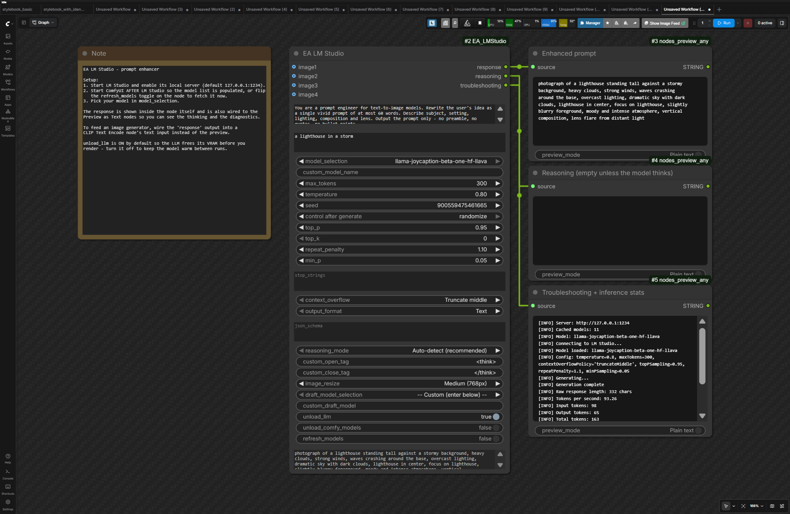
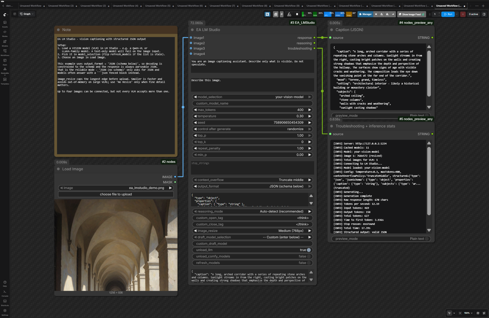

# EA_LMStudio

 The most fully-featured [LM Studio](https://lmstudio.ai/) integration for ComfyUI — auto model discovery, multi-image vision, reasoning extraction, structured JSON output, full sampler control, cancellable streaming, and built-in VRAM management.


_Text-only: a prompt enhancer. The response renders inside the node, and `troubleshooting` reports exactly which parameters were applied plus full inference stats._


_Vision: captioning an image with a VLM into schema-constrained JSON that downstream nodes can parse directly._

 This node is ready to be integrated into your workflows in dozens of ways!

## Features

- **Auto Model Discovery** - Models populate automatically from LM Studio at startup
- **Vision Support** - Up to 4 image inputs with smart auto-resize to prevent OOM
- **Reasoning Extraction** - Uses LM Studio's own reasoning split when the model has Reasoning Parsing configured, and falls back to tag detection (DeepSeek R1, Qwen3, QwQ, GLM, GPT-OSS "harmony" channels, and similar) when it does not
- **Structured JSON Output** - Constrain decoding to a JSON Schema so downstream nodes can parse the response
- **Cancellable & Streamed** - ComfyUI's cancel button really stops a runaway generation, and the queue progress bar tracks tokens instead of the node looking frozen. If the connection to LM Studio dies mid-generation, everything received so far is returned instead of discarded
- **In-Node Response Preview** - The generated text appears inside the node; no extra preview node required
- **Advanced Controls** - Temperature, top-k/p, min-p, repetition penalty, stop strings, context-overflow policy, speculative decoding
- **Honest Diagnostics** - Every parameter is checked against the config LM Studio reports back, so a setting that silently does nothing is reported instead of hidden
- **Detailed Stats** - Tokens/sec, time to first token, stop reason, token counts, and speculative-decoding acceptance rates
- **VRAM Management** - Auto-unload after generation (enabled by default), including the draft model, and confirmed against LM Studio rather than assumed — so the next node in the workflow really does see the memory back

## Installation

**Via ComfyUI Manager** (recommended): Search for "EA_LMStudio"

**Manual:**
```bash
cd ComfyUI/custom_nodes
git clone https://github.com/EnragedAntelope/EA_LMStudio.git
pip install -r EA_LMStudio/requirements.txt
```

## Requirements

- **LM Studio** with the local server enabled. Validated against **LM Studio 0.4.19**.
- The **`lmstudio`** Python package (installed via `requirements.txt`). Requires Python 3.10+.

> **Keep LM Studio and the `lmstudio` package updated.** The SDK discards prediction parameters it does not recognise instead of raising, so an out-of-date package can turn a setting into a silent no-op. The node now compares what it sent against the config LM Studio echoes back and reports any parameter that was dropped, in the `troubleshooting` output.

## Quick Start

1. Start LM Studio with server enabled (default: `http://127.0.0.1:1234`)
2. Start ComfyUI
3. Find the node: **EA -> LMStudio**

Ready-made workflows live in [`example_workflows/`](example_workflows) — drag one onto the ComfyUI canvas:

| Workflow | What it shows |
|----------|---------------|
| `01-prompt-enhancer.json` | Turning a short idea into a rich t2i prompt, with reasoning and stats previews |
| `02-vision-caption-json.json` | Captioning an image with a VLM into schema-constrained JSON |

## Tips

- **Models not showing?** LM Studio must be running before ComfyUI starts - if it was unreachable at startup, the node warns you once when the page loads. Toggle the `refresh_models` checkbox to instantly re-fetch and update every EA LM Studio node's dropdowns.
- **Context errors?** Increase context length in LM Studio settings (not max_tokens). Set `context_overflow` to `Stop at limit (error)` if a silently shortened prompt would be worse than no answer.
- **VLM issues?** Try a smaller image resize option or a single image if multi-image fails.
- **Force thinking mode:** Add `/think` to the prompt (Qwen3 family) or "Think step by step" for others. LM Studio's API has no thinking on/off flag — see below.
- **Thinking leaking into the response?** LM Studio splits reasoning from the answer only when the model's **Reasoning Parsing** delimiters are configured. Set them in LM Studio (per model) and the node uses that split directly. Otherwise it falls back to tag detection, and reports it when a tagless `Thinking Process:` preamble appears to have leaked through.
- **Reducing repetition:** Raise `repeat_penalty` (1.1-1.3) and/or use `min_p` (0.05-0.1) as a modern alternative to `top_p`. LM Studio has no presence or frequency penalty.
- **Guaranteed parseable output:** Set `output_format` to `JSON (schema below)` and supply a schema. `JSON (no schema)` only *asks* for JSON — it does not constrain decoding, and many models answer with a ```` ```json ```` fenced block (the node unwraps that automatically when the contents are valid JSON).
- **Speculative decoding not helping?** The troubleshooting output reports the draft-token acceptance rate. Below ~30% the draft model is usually costing more than it saves.
- **Wiring `prompt` from another node** (prompt-enhancer chains): right-click the widget and choose **Convert Widget to Input** - ComfyUI turns any widget into a connectable socket, no special node support needed.
- **Generation ended early / timed out?** If LM Studio sends no data for ~60s the SDK aborts with a timeout. Usually the model is still loading or the server is busy - retry. Partial output received before the failure is returned rather than thrown away.

## Custom Server

Edit `lms_config/user_config.json`:
```json
{
    "server_host": "192.168.1.100",
    "server_port": 1234
}
```

### API Token (authenticated servers)

LM Studio 0.4.0+ can require an API token. Because workflows are shared as plain-text JSON, the token deliberately has **no node widget** - it would leak with every posted `.json`. Instead, set it once per machine:

```json
{
    "api_token": "your-token-here"
}
```

or export the `LM_API_TOKEN` environment variable (the `lmstudio` package's own convention; a value in `user_config.json` wins). Model discovery always honours it; generation needs `lmstudio >= 1.6`, and the node logs a clear warning if your installed SDK predates token support.

> **Note on transport:** LM Studio's server speaks plain HTTP - it has no built-in TLS (as of 0.4.x). For tokens over any network that is not localhost-only, front LM Studio with a TLS reverse proxy (Caddy/nginx) and point `server_host` at it.

## Model Exclusion Patterns

Exclude models from the dropdown by adding patterns to `lms_config/user_config.json`:
```json
{
    "excluded_model_patterns": ["embedding", "Qwen3-Coder", "codellama"]
}
```

- The default excludes all models containing **"embedding"**.
- Patterns are matched as case-insensitive substrings against the full model identifier.
- Use specific enough patterns to avoid accidentally excluding desired models (e.g., use `Qwen3-Coder` instead of just `coder`).
- To find exact model names, check LM Studio's API: `http://127.0.0.1:1234/v1/models` (look at the `id` field).
- The `user_config.json` file is gitignored so your settings survive updates.
- Restart ComfyUI or toggle the **refresh_models** checkbox after changing patterns.

A model whose identifier contains characters the node will not accept (LM Studio occasionally serves ids like `some-model@?`) is hidden from the dropdown and named in the `troubleshooting` output, so it is never a silent disappearance.

## Outputs

| Output | Description |
|--------|-------------|
| response | Generated text (reasoning removed if extracted) |
| reasoning | Extracted thinking content |
| troubleshooting | Status messages, debug hints, and inference stats (tokens/sec, input/output/total tokens, time to first token, stop reason, speculative-decoding acceptance, total time) |

The response also renders inside the node itself, so a preview node is optional.

## Upgrading from 1.x

You do not need to rebuild anything. When a workflow saved by 1.x is loaded, the node detects the old layout and silently realigns every remaining setting to the right widget.

If you relied on `enable_thinking`, the equivalents that genuinely work are configuring **Reasoning Parsing** for the model in LM Studio, editing the model's Jinja template (``), or a `/think` / `/no_think` marker in the prompt for Qwen3-family models.

## License

[MIT License](LICENSE)

---

*Originally based on [YANC_LMStudio](https://github.com/ALatentPlace/YANC_LMStudio) by A Latent Place*
